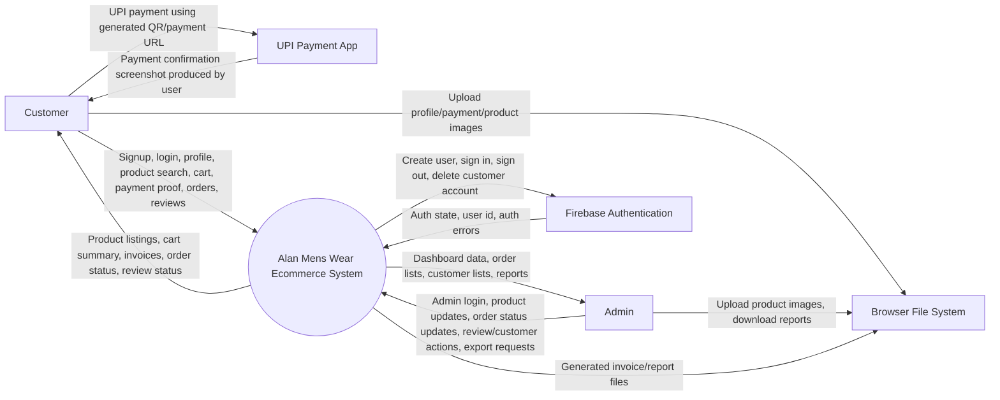
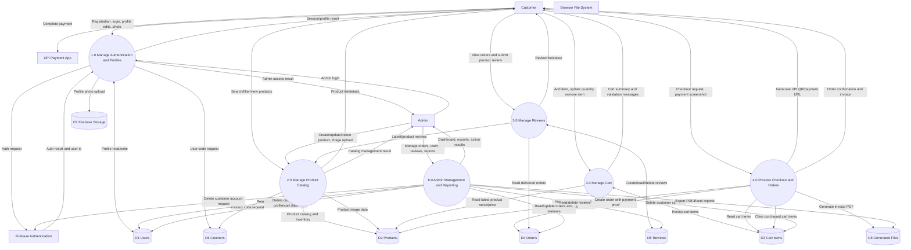
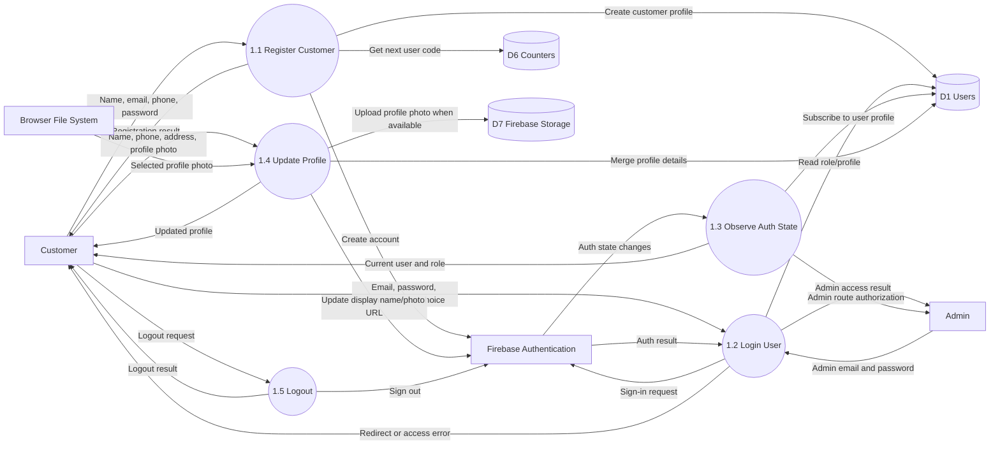
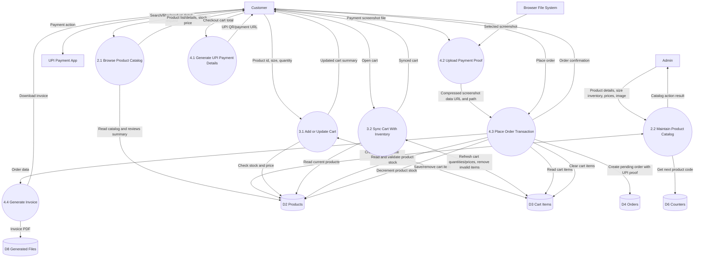
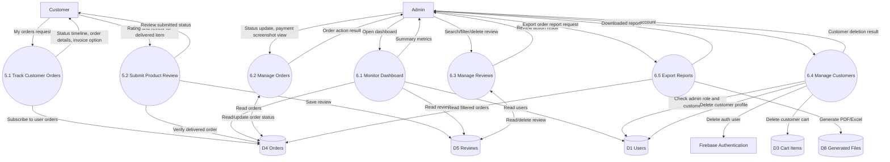

# Alan Mens Wear - Data Flow Diagram

This document describes the Data Flow Diagram (DFD) for the Alan Mens Wear React and Firebase ecommerce project.

## System Scope

Alan Mens Wear is an online menswear store where customers can register, browse products, maintain a cart, pay through UPI, upload payment proof, place orders, track order status, download invoices, and submit reviews. Admin users manage products, orders, reviews, customers, and reports.

## DFD Notation

| Symbol Type | Meaning |
| --- | --- |
| External Entity | A person or external service that sends data to, or receives data from, the system |
| Process | A system activity that transforms input data into output data |
| Data Store | Persistent storage used by the system |
| Data Flow | Movement of data between entities, processes, and stores |

## External Entities

| Entity | Description |
| --- | --- |
| Customer | User who browses products, manages cart, places orders, edits profile, and submits reviews |
| Admin | Privileged user who manages products, customers, orders, reviews, and exports reports |
| Firebase Authentication | External authentication service used for signup, login, logout, and account deletion |
| UPI Payment App | External payment application used by the customer to complete payment |
| Browser File System | Customer/admin device file system used for image upload, invoice download, and report download |

## Data Stores

| Store | Firebase Path / Location | Main Data |
| --- | --- | --- |
| D1 Users | `users/{uid}` | Customer/admin profile, role, contact details, user code |
| D2 Products | `products/{productId}` | Product details, prices, images, size inventory, stock |
| D3 Cart Items | `carts/{userId}/items/{cartItemId}` | User cart items, selected size, quantity, item price |
| D4 Orders | `orders/{orderId}` | Order items, customer details, total, payment proof, order status |
| D5 Reviews | `reviews/{reviewId}` | Product reviews, ratings, customer and order references |
| D6 Counters | `counters/{counterName}` | Running counters for user and product codes |
| D7 Firebase Storage | `profile-photos/...` | Profile photos in production when upload succeeds |
| D8 Generated Files | Browser downloads | Invoices, PDF reports, Excel reports |

## Level 0 - Context Diagram

## Level 1 - Main System DFD

## Level 2 - Authentication and Profile Management

## Level 2 - Product, Cart, and Checkout

## Level 2 - Order Tracking, Reviews, and Admin Management

## Major Data Flows

| Flow | Source | Destination | Data |
| --- | --- | --- | --- |
| Registration data | Customer | Authentication/Profile process | Name, email, phone, password |
| Auth result | Firebase Authentication | Application | User id, email, session state, auth errors |
| Profile data | Application | Users store | Name, phone, address, role, photo URL, user code |
| Product data | Admin | Products store | Name, category, price, size inventory, image, description |
| Product browsing data | Products store | Customer | Product listing, stock, ratings, prices |
| Cart data | Customer | Cart store | Product id, selected size, quantity, calculated price |
| Payment details | Application | Customer | UPI QR code, UPI id, total amount |
| Payment proof | Customer | Orders store | Screenshot data URL/path, payment method, verification status |
| Order transaction | Application | Products and Orders stores | Stock decrement, order items, total amount, pending status |
| Order status | Admin | Orders store | Pending, Processing, Shipped, Delivered |
| Review data | Customer | Reviews store | Rating, review text, product id, order id |
| Report data | Orders store | Browser file system | Excel/PDF order report |
| Invoice data | Orders store | Browser file system | Customer invoice PDF |

## Important Processing Rules

1. Customers must be authenticated before placing orders, viewing personal orders, editing profiles, or submitting reviews.
2. Admin routes require a signed-in user whose `users/{uid}.role` is `admin`.
3. Cart quantities are validated against latest product stock before saving and again before order creation.
4. Checkout uses a Firestore transaction to verify product availability, update product inventory, and create the order.
5. Payment is performed outside the system through UPI; the system stores the uploaded payment screenshot as proof.
6. Reviews are allowed only for delivered orders and are stored separately from orders.
7. Customer deletion is handled through a Firebase Cloud Function that checks admin permission, deletes the Firebase Auth user, and removes the customer profile/cart data.
8. Invoices and reports are generated client-side as downloadable PDF/Excel files.

